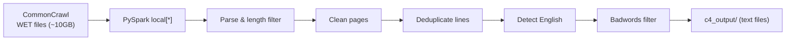

# C4 Dataset Setup & Run Plan

Run the C4 English pipeline locally on ~10GB of CommonCrawl WET data, from a clean machine to processed output.

## Pipeline Overview



## Steps

### 1. Install System Dependencies

- Install Java (required by Spark): `sudo apt install -y default-jdk`
- Install Miniconda if not present

### 2. Create Python Environment

```bash
conda create -y -n c4-env python=3.9
conda activate c4-env
cd /home/noamzilo/src_tpu3/c4-dataset-script
pip install -e .
python -m nltk.downloader punkt punkt_tab
```

### 3. Download ~10GB of WET Files

```bash
mkdir -p ~/cc_data/wet_files
wget "https://data.commoncrawl.org/crawl-data/CC-MAIN-2024-51/wet.paths.gz"
gunzip -c wet.paths.gz | head -50 > wet_paths_small.txt
while read path; do
    wget -q -P ~/cc_data/wet_files "https://data.commoncrawl.org/$path"
done < wet_paths_small.txt
```

Each WET file is ~150-200MB compressed; 50 files ≈ 10GB.

### 4. Run the Pipeline

```bash
WET_FILES=$(ls ~/cc_data/wet_files/*.warc.wet.gz | tr '\n' ' ')

python /home/noamzilo/src_tpu3/c4-dataset-script/c4_dataset_script/c4.py \
    --wet-file-paths $WET_FILES \
    --c4-save-path ~/cc_data/c4_output
```

The entry point is [`c4_dataset_script/c4.py`](c4_dataset_script/c4.py) — `main()` runs the full Spark pipeline. English filtering is built into the pipeline via `c4_utils.detect_english`. No extra flags needed.

### Key Files

- [`c4_dataset_script/c4.py`](c4_dataset_script/c4.py) — main pipeline script
- [`setup.py`](setup.py) — dependencies (`pyspark`, `tensorflow-datasets==4.6.0`, `nltk`, `langdetect`)
- [`c4_dataset_script/badwords/en`](c4_dataset_script/badwords/en) — English badwords list (already included)

### Notes

- Runs fully locally, no Spark cluster needed (`local[*]` default)
- If OOM: add `--spark-master "local[2]"` to limit parallelism
- `tensorflow-datasets==4.6.0` is pinned; if TF conflicts arise, pin `tensorflow==2.10` as well